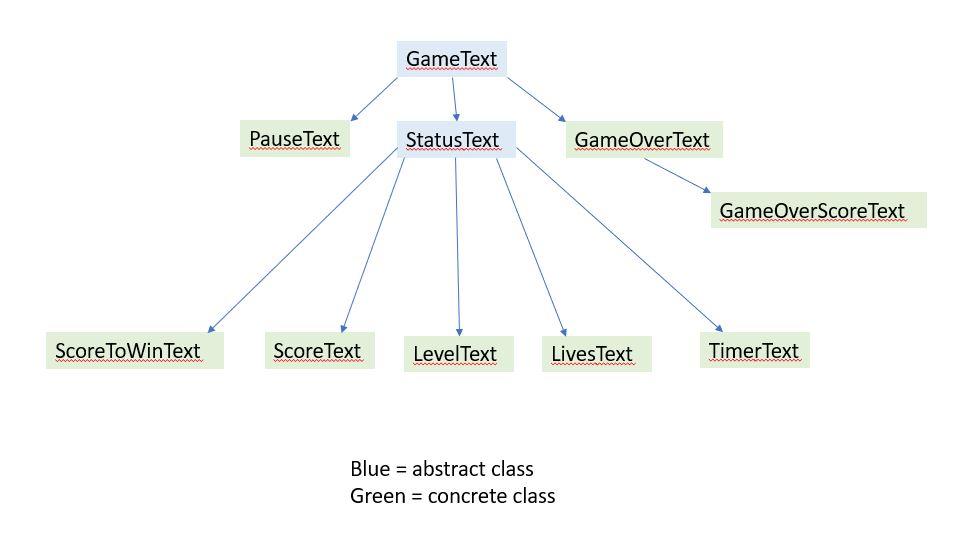

# Game Design Final
### Names Anna Diemel (ad356) and Katherine Barbano (kab134)

## Team Roles and Responsibilities

 * Team Member #1: Anna Diemel
 Physics of ball interacting with blocks, 3 different types of
 power ups, reading in BlockConfiguration from text file, moving
 blocks, blocks with varying hardness, most recent scores display,
 score.

 * Team Member #2: Katherine Barbano
Physics of ball interacting with paddle and scene boundaries,
how the game flows (i.e. losing, winning, losing lives, progressing
through levels), all the cheat keys, text package, InfoBar and
status displays for level number, score to win, timer, 
pausing and unpausing, lives.

## Design goals

#### What Features are Easy to Add

It is very easy to add a new level to the game - you only need to
edit the data, not any code.

It is also easy to add new status indicators as text on the infobar,
or any text into the game in general.

It is easy to create new types of power ups that have different
effects.

It is easy to create different types of blocks.

## High-level Design

#### Core Classes

The text package is a hierarchy that encompasses all text that
is used in the program. Some of this text is level-specific, such as 
TimerText, ScoreToWinText, and is added in the Level class, but
some of it is Game-specific, such as ScoreText. An InfoBar object in
the gameElements package combines many of these text elements together
that are displayed in a single program. GameText is an abstract superclass
with methods to add and remove text from the scene, while StatusText is an abstract
superclass for text that has some format "label: value". The subclasses
override a method that sets the label, position, and other properties.
Text that does not fit into this format specifically are descended directly
from GameText.

The gameElements package handles all individually displayable
components of the game. Ball and Paddle
handle the physics of collisions and interaction with blocks
and power-ups respectively. BlockConfiguration reads in a text file and stores BlockRow objects. BlockRow contains a single row of Block objects,
where each BlockRow can be either
a FilledBlockRow (which is what a normal row looks like) or a MovingBlock (a single moving block occupies an entire row).
FilledBlockRow and MovingBlock both extend BlockRow. This package
also has a PowerUp abstract class that handles much of the
setting the properties and showing the power up, as well as an abstract
method for applying the effect of the power up that the subclasses override (BreakerBallPowerUp, SlowBallPowerUp, PaddlePowerUp).

The breakout package handles combining separate game elements together into
a functioning Scene. The Level class handles the InfoBar, BlockConfiguration,
Ball, and Paddle for a single level in the game. The Game class handles
moving through multiple Levels, handling game goals of winning and losing, 
and setting up text that is not Level-specific. Cheat keys are implemented in
either the Game or Level class, depending on whether the cheat key itself
is relevant to the entire game, or only to an individual level.

## Assumptions that Affect the Design
- The format of the text file used to describe the block configuration
and power ups. Also the format of the text file used to describe
the score to win and time for each level. The format is described
in the README.
- Moving blocks should only be created in a row with no other blocks present.
  This means that if a level file contains an "M", the rest of the row with
  the "M" in it should be all "0"s.
- Each directory within the "data" folder represents a game that can
be played through. Each file within this directory represents a single
level. The filename of each level should contain a positive integer
that corresponds to which level it represents in the game. There should
be no other numerics present in the level filename. For example,
"level_1.txt" would be a valid filename.

#### Features Affected by Assumptions
- The fact that moving blocks should only be created in a row
with no other blocks affected the design of the MovingBlockRow, FilledBlockRow,
and BlockRow hierarchy.
- The assumption that each file in a game's folder represents one level
affected the design of the Level class, and how different Levels are
accounted for in a List within Game.

## New Features HowTo

#### Easy to Add Features

New levels:
To add a new level, create a new text file within data/sample_game.
The filename must include a numeric value corresponding to the level
number (that should not conflict with any other level numbers already present).
The format of this text file includes blocks and power ups in the format
specified in the README.

In addition, you should access the file in data/sample_game without
any numeric value in the title (in this case, it is "level_scores_to_win_and_time.txt")
and add a new line with the score to win the level and
the time limit of the level. The row number that you should add this on
should be the same as the level number (e.g. level 2 is on the second row).
This is also described in the README.

After than adding this data, the program completely handles the addition
of the new level and it should display in addition to the old levels once these are added.

New status indicators:
Create a subclass of StatusText in the text package that overrides a method
to dictate the position and title of this text. Add this new status
indicator to the add/remove from scene methods in the InfoBar class in order to display it on the InfoBar.

New text:
Create a subclass of GameText that overrides how the text is initialized.

New type of Block:
Create a subclass of Block.

New type of Power Up:
Create a subclass of PowerUp that overrides givePowerUp. In BlockConfiguration,
add this new type of power up as a case in releasePowerUpInBlock.

#### Other Features not yet Done
- Creating a new class to maintain a List of Game objects, so that
the user can select a single game to play out of a list of several
games.
- Different types of functionally different Levels: create subclasses that extend Level, and instantiate the type of Level
based on an indicator in the level's block configuration text file.
